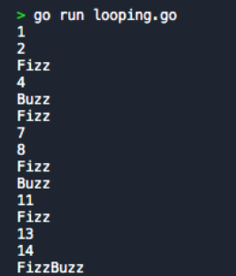

# Mini Challenge 1 - FizzBuzz [assignment](https://classroom.google.com/u/5/c/NjIwOTI4ODYzNjMy/a/NjI0NTg2NDA0MTgw/details)

Buatlah looping berkondisi dengan variable n sebagai penentu maksimal number loopingnya,

Setiap looping dengan angka kelipatan 3 maka diganti dengan kata “Fizz”

Setiap looping dengan angka kelipatan 5 maka diganti dengan kata “Buzz”

Setiap looping dengan angka kelipatan 3 dan 5 maka diganti dengan kata “FizzBuzz”

contoh:

## Output jawaban

