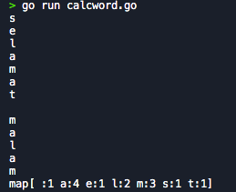
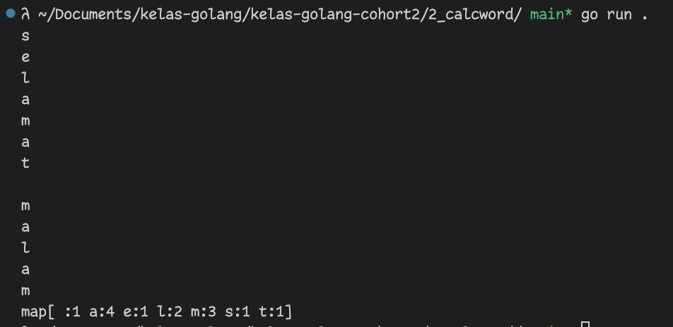

# Mini Challenge 2 - Calculating Words Appear [assignment](https://classroom.google.com/u/5/c/NjIwOTI4ODYzNjMy/a/NjI1MDg1NTU5NTQy/details)

Buatlah looping dengan variable yang berisi string suatu kalimat dan pecahlah kalimat tersebut menjadi 1 per 1 kata

Setelah sudah dipecah, lakukan perhitungan munculnya kata dari variable tersebut dengan cara mapping golang

Contoh Output dapat dilihat pada gambar yang di attach

contoh:

## Output jawaban

