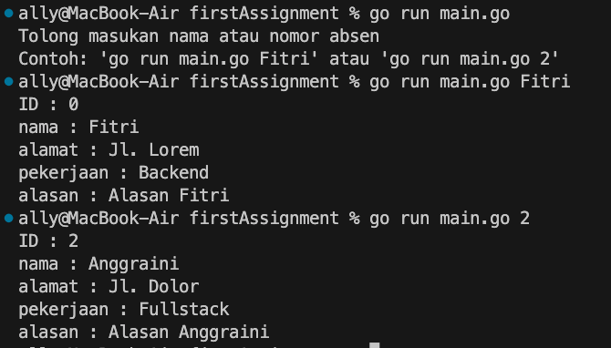

# Mini Challenge 3 - Struct, Slice, Map, Function [assignment](https://classroom.google.com/u/5/c/NjIwOTI4ODYzNjMy/a/NjI2MTY1MDU4OTE0/details)

Buatlah sebuah service berupa CLI untuk menampilkan data teman-teman kalian di kelas.

Contohnya, ketika kalian menjalankan perintah “go run main.go Fitri” maka data yang akan muncul adalah data teman kalian dengan absen no 1. Data yang harus ditampilkan yaitu: 
Nama
Alamat
Pekerjaan
Alasan memilih kelas Golang

Gunakanlah struct dan function untuk menampilkan data tersebut. Kalian bisa menggunakan os.Args untuk mendapatkan argument pada terminal.


Flow teknis coding :
import os dan fmt
Buat logic untuk menampilkan/generate data peserta dari cli by name, contoh cli : go run main.go Fitri
Buatlah looping yang memproses slice of string dari beberapa nama peserta, dimana jika nama yg di ketik pada cli sama dengan yang ada di data peserta maka akan dapat index dari data pesertanya dan di append pada data baru untuk ditampilkan pada CLI atau terminal.

contoh:




## Output jawaban

```bash
☁  3_CLIservice [main] ⚡  go run main.go 
Tolong masukan nama atau nomor absen
Contoh: 'go run main.go jamal' atau 'go run main.go 3'

☁  3_CLIservice [main] ⚡  go run main.go simon
id           : 3
name         : simon
address      : 2 Manitowish Trail
job          : Human Resources Manager
reason       : User-centric even-keeled solution

☁  3_CLIservice [main] ⚡  go run main.go 7    
id           : 7
name         : marcello
address      : 843 Northview Circle
job          : Help Desk Operator
reason       : Grass-roots logistical conglomeration

☁  3_CLIservice [main] ⚡  go run main.go jamal
Tidak ada yang bernama jamal

☁  3_CLIservice [main] ⚡  go run main.go 20   
Tidak ada yang memiliki nomor absen 20

```
