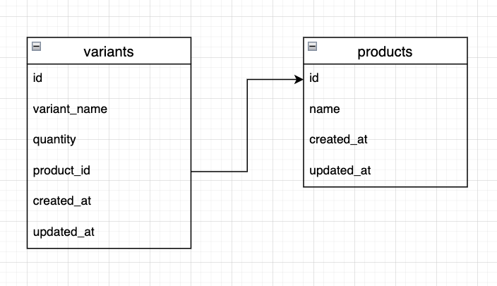

# Mini Challenge 6 - Go SQL


Buatlah simple CRUD dengan studi kasus di bawah ini. Dimana terdapat 2 table yaitu products dan variants dengan association one to many. Buat dengan menggunakan Go SQL. Yang harus kalian buat adalah: 

- createProduct()
- updateProduct()
- getProductById()
- updateUserById()
- createVariant()
- getProductWithVariant()
- deleteVariantById()




## Cara menjalankan

### 1. Install sqlite driver

```bash
$ go get -u github.com/mattn/go-sqlite3
```

Note: Tidak perlu config connection string, akan otomatis membuat file database sqlite bernama 'product.db'

### 2. Run 

```bash
$ go run main.go
```